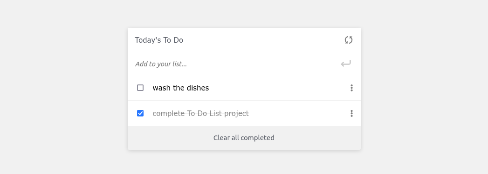

# To-Do-List

This is my To-Do-List page. On this page you can write down a list of activities or reminders and delete them when they are finished.

This page is the first project I am doing using Webpack.

## Project Setup

- Clone this repository (use this SSH key git@github.com:leonardodiasb/To-Do-List.git).
- Open the folder project (To-Do-List).
- Install all dependencies with "npm install" in the command line.
- Run the project with "npm start" and the project will load automatically in your default browser

## Built With

- HTML
- CSS
- JS
- Webpack

👤 **Author**

- GitHub: [@leonardodiasb](https://github.com/leonardodiasb)

## 🤝 Contributing

Contributions, issues, and feature requests are welcome!

## Show your support

Give a ⭐️ if you like this project!
